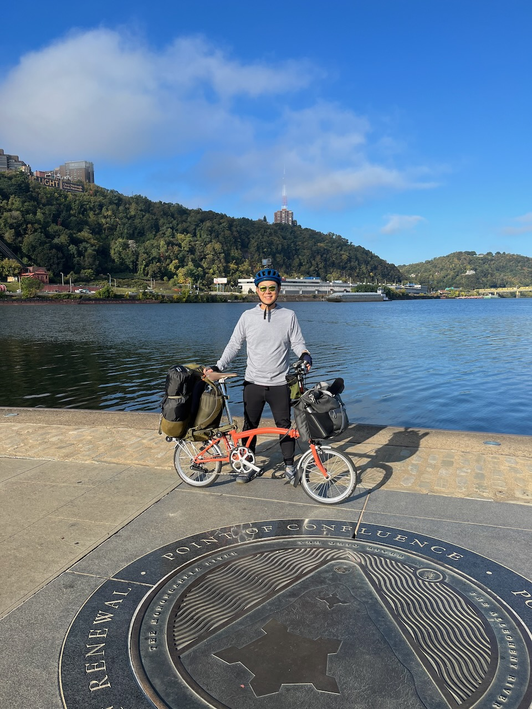
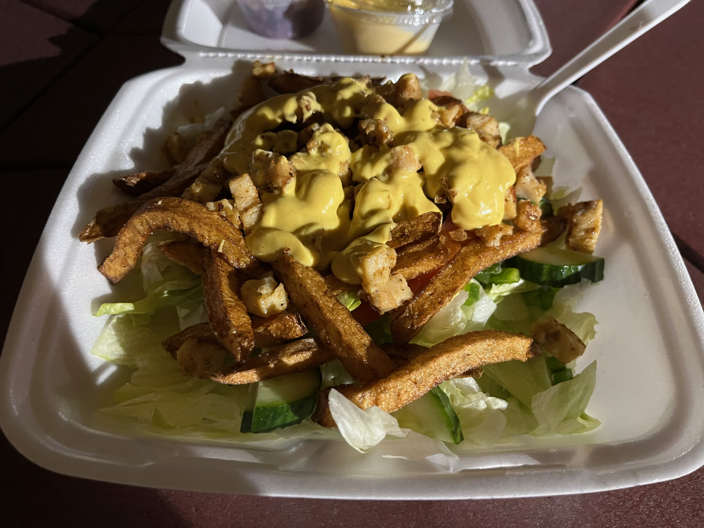
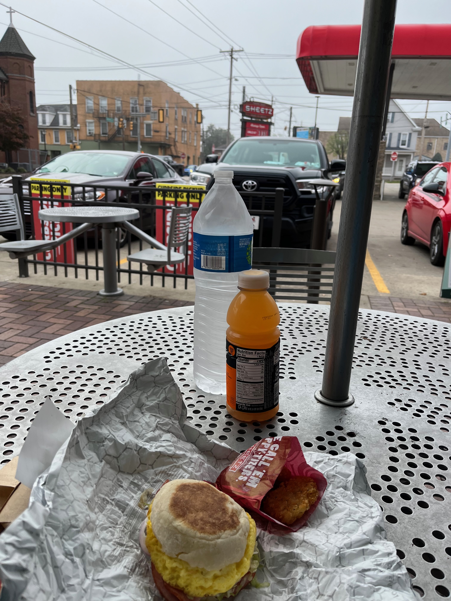
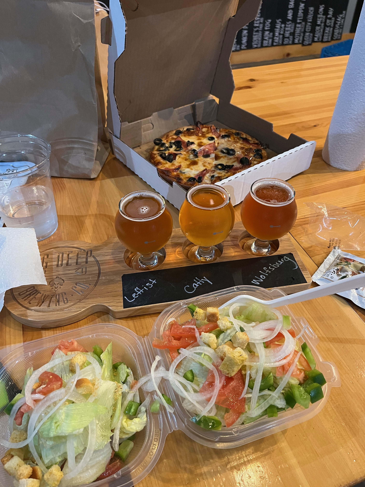

+++
date = 2025-02-04T16:14:09-05:00
draft = false
title = 'My GAP Trail Trip Oct 2023'
+++

I've always mostly been a commuter/utility cyclist but I also was intrigued by the idea of cycling being a means of exploring. One of my neighbors told me about a bike adventure she had on the GAP Trail and I was intrigued. 

If you haven't heard of the [GAP (Great Allegheny Passage) Trail](https://gaptrail.org/), it's a ~150 mile bike trail that's 95+% separated from automobiles that connects Pittsburgh, Pennsylvania and Cumberland, Maryland. While that sounds daunting to folks who've never considered cycling anywhere close to that distance, there are many reasons why the GAP Trail is one of the most accessible trails to do a multi-day bike trip.

1) **Hard trail surface.** The GAP Trail is almost entirely either hard-packed fine limestone or paved asphalt. This means you don't need a special gravel or touring bike or any particular type of tires for the GAP Trail. Being able to have a multi-day bike adventure with the bike you already have eliminates potentially the largest expense to preparing for a bike trip. I did my GAP Trail ride with my Brompton folding bicycle which as 16" wheels and urban commuter tires!

2) **Mostly flat.** One of the first decisions you'll have to make is deciding whether to go from Pittsburgh to Cumberland or the other way around. Either way, the incline isn't too challenging, especially when going from Pittsburgh to Cumberland--the first 120 miles is a gentle incline of just under 2,500 ft which sounds like a lot but remember, it's over 120 miles which results in an average grade of +0.2%. For the vast majority of that 120 miles, you can barely tell that you're going uphill. The fun part of going in this direction is the reward at the end for doing the gentle climb--the last 30 miles takes you downhill 1,800 ft so for much of it, you can even coast towards the end!

3) **Towns, amenities, and human civilization.** Even though the GAP Trail is mostly separated from car traffic and at points, there are long stretches through pure nature, there are many towns on the trail where you can get food, drinks, lodging, and more. This provides a lot of flexibility in the type of bike trip you want to do from fully "roughing it" by camping/cooking to entirely staying in hotels/B&Bs and eating at restaurants. There are also a number of businesses that will haul your luggage for you to make it even easier! I took a hybrid approach which I'll describe in more detail later.

4) **Car-free start and finish access.** One of the challenges of doing a linear trail is planning around how to get to the trail and get back home. For most trails, people have to find someone to drive them to the start of the trail and pick them up from the end. I'm sure many people do that for the GAP Trail. What makes the GAP Trail unique is that the start and end points have Amtrak stations--with some planning, you can bring your bicycle on the train and if you live in a city on an Amtrak line, it's possible to go from the front door of your home to the GAP Trail and back without a car!

---

At this point, hopefully I've eased some of your concerns about doing something like the GAP Trail even if you've never done anything remotely close to it before. While the GAP Trail is probably the easiest and most convenient 150 miles bike trip you can do in the US, I still recommend taking the time to plan your trip weeks, if not months, in advance. There are so many different permutations for doing the GAP Trail depending on how much time you have, your physical abilities, budget, etc. so I'm not going to even try to give you all the options. What I'll present here is exactly how I went about planning my trip and what I ended up doing.

It can be overwhelming to take in all the information and start to make decisions about what kind of trip you do. I hope my trip plans are helpful for you to in case you want to do something similar. 

## Trip duration: three or four days? Or even less???

One of the first decisions you'll need to make is the duration of your trip. I've heard the most popular itinerary is a four-day ride. If you have the time to ride four days in addition to the time to get to the trail and back home, I would recommend that because a four day ride provides an ideal even spacing of mileage between towns that offer lodging and food. I had previous commitments which forced me to do the GAP Trail in three days. The best three day itinerary I could come up with that lands me in a town where I can sleep and get something to eat is:

Day 1 (~60 miles): Pittsburgh, PA to Connellsville, PA  
Day 2 (~60 miles): Connellsville, PA to Meyersdale, PA  
Day 3 (~30 miles): Meyersdale, PA to Cumberland, MD  

It's not ideal because it results in the first two days being twice as long as the third day. And that third day is mostly downhill, so it feels even shorter! There were places where I wish I could stay a bit longer to enjoy the scenery or just relax, but I felt some time pressure to get back on the trail so I could get to my destination before sunset. 

The popular four-day itinerary looks like this:

Day 1 (34 miles): Pittsburgh, PA to West Newton, PA  
Day 2 (42 miles): West Newton, PA to Ohiopyle, PA  
Day 3 (42 miles): Ohiopyle, PA to Meyersdale, PA  
Day 4 (32 miles): Meyersdale, PA to Cumberland, MD  

There are also people who do the GAP Trail in two days or even one, but you'll likely need to be of better-than-average fitness and not want to spend too much time making stops. 

## Friday, Sept 29

I don't own a car so the ability to get to and from the trail was a big draw for me. I live just under three miles from 30th Street Station which is Philly's main Amtrak station, so I biked from my house to the train station around noon to catch the 12:42pm Pennsylvanian train to Pittsburgh. 

If you have a full size bike, you may have to include a bike reservation with your Amtrak ticket depending on the route. The Pennsylvanian requires bike reservation and offers Trainside Checked Bicycle Service. If you have a folding bike like me, the folded bicycle is treated as luggage and you can bring it on board as long as it fits in the normal luggage storage areas or overhead compartment. Here are all the details about what sort of bicycle accomodations are available on various routes: [https://www.amtrak.com/bring-your-bicycle-onboard](https://www.amtrak.com/bring-your-bicycle-onboard). 

The train ride from Philly to Pittsburgh is seven hours long. I don't remember exactly what I did on the train ride, but I recall the time passing more quickly than I expected. There's a cafe car on the Pennsylvanian--Amtrak food isn't great, but you won't starve. One of the highlights of this train route is traveling on the famous [Horseshoe Curve](https://en.wikipedia.org/wiki/Horseshoe_Curve_(Pennsylvania)). 

My train was delayed out of Philly so I got into Pittsburgh later than planned. I was hoping to get in early enough to have a decent meal but everything was closed by the time I got in. I booked my first night's stay at [The Traveler's Rest Hotel](https://www.sstrpgh.com/), so I rolled out of Pittsburgh Union Station for a short 1.8 mile ride to the hotel. It used to be a hostel, but now, all their rooms are private. It still maintains a hostel vibe, with common areas and a shared kitchen. They specifically cater to folks doing the GAP Trail so it has a bike room with tools in case you need to do any maintenance. Unless you're specifically looking for a typical hotel room, I highly recommend The Traveler's Rest. 



## Saturday, Sept 30

Since I missed out on getting a proper dinner the night before, I wanted to get a good breakfast before heading off on the trail. My original plan was to go to Gabriella's Cafe, which apparently is now [Chace's Cafe](https://maps.app.goo.gl/3s8y7Z4ix1JkRF3F8), just a few blocks from the hotel. They were supposed to open at 7am but they were running late for some reason. I eventually gave up and biked over to [O'Leary's Restaurant](https://maps.app.goo.gl/qWK2dEsgXSY7HzrP6) instead. Stepping into O'Leary's felt like I was transported back to the 60s or 70s. Really cool old school vibe, with good hearty food. 

I went back to the hotel to get ready to leave. I could've hopped on a trail on the south side of the Monongahela River that connects to the GAP Trail, but I wanted to start at [Point State Park](https://maps.app.goo.gl/AnYp8qEBuyZvtKuL7) which is the official start (or end if you started in Cumberland), so I left the hotel around 8:50am and biked back across the river into Downtown. There were other people at the starting point about to head off on the GAP Trail. After taking some photos, I departed at 9:15am on my GAP Trail adventure.

I was pleasantly surprised by how good the bike infrastructure is in downtown Pittsburgh. Here's a two-way curb protected bike lane:

 
\
My first stop was in West Newton, PA, 34 miles out from the start. If I was doing the popular four day itinerary, this would be it for the day. I rolled in at around 1:15pm and stopped for lunch at [The Trailside](https://maps.app.goo.gl/Cxn6PsgGRcALRDXk9). My original plan was to eat at [Mama Pepino's Pizza](https://maps.app.goo.gl/v9JCFHLfo9dmyp5i6) but I made some friends that morning who recommended eating at The Trailside so we had lunch together.

My plan for the first two nights on the trail was to camp, so I brought a tent with me and made reservations in advance for a campsite. The first night's stay was at the Uniontown KOA just outside of Connellsville, PA. I've never stayed at a KOA, but it's a great way to do tent camping while still having modern conveniences like a shower, bathrooms, and even a camp store with hot prepared food and snacks. They also have a pool, an arcade, playground, and laundry facilities. 

Note: the Uniontown KOA is now known as [The Blue Canoe RV Resort](https://maps.app.goo.gl/ooQAZnN8FrAShs3H8). 



I made really good time on day one, so I got in to the KOA just before 5pm, plenty of time to pitch my tent and get settled before sunset. I took advantage of the cafe at the camp store to get a salad for dinner. This is when I was first introduced to the western PA practice of having french fries on salad. 

## Sunday, Oct 1

The next morning, I rolled out from the campground. The tent sites were literally on the trail itself as you can see:


\
While I could've had breakfast at the camp store, it didn't open early enough and I knew there was a Sheetz in the next town. I'm not in Sheetz country very often so when in Rome...

So while much of day 1 was getting out of the Pittsburgh metro area, the territory covered in day 2 was much more remote and in nature. There were so many cool bridges with great views and a tunnel. I think there are four tunnels on the GAP Trail; three of them have lights, but the Pinkerton Tunnel doesn't and when you're in the middle of it, it's pitch black. I forgot to turn on my lights before going into the tunnel so I was cycling blind. The GoPro footage doesn't quite capture just how dark it is. 


\
I stopped for lunch in Confluence, PA at the [Rivers Edge Cafe](https://maps.app.goo.gl/EwewFdtHYXL6JnSt8) and [Trailhead Brewing](https://maps.app.goo.gl/L7grA86ME2dJuciW6) in Rockwood, PA. 



I wish I had more time to go at a leisurely pace because by the time I finished my beers at Trailhead, I still had another 12 miles to go to get to the campground in Meyersdale. Distance-wise, Rockwood would've been a great place to end the day, but there aren't any campgrounds or other lodging in town. I left the brewery around 6pm and knew I had to get moving if I wanted to set up my tent while there was still light out. I made it to the [Festival Park Campground](https://maps.app.goo.gl/KBFLLBSarbyThtvd7) just in time. 

This campground doesn't have the amenities that the Uniontown KOA had. This site is the home of the Pennsylvania Maple Festival which happens in April. There are some other events that take place here but at other times, this is a small campground right in the middle of town that feels like you're in someone's big backyard. 



## Monday, Oct 2

One of the perks of tent camping right in the middle of a town is having restaurants and a convenience store just blocks away. I had pizza for dinner at [Take Six](https://maps.app.goo.gl/7Sx4Wjvx7xaw366B6), breakfast next morning at [Donges](https://maps.app.goo.gl/62hJJDmqpQScEzFEA), and made a stop at [Sheetz](https://maps.app.goo.gl/Jk59JkJzFR7uxBUPA) to get some snacks and drinks before heading back to the trail -- all within two blocks of the campground.



Day three was a short day so I took it easy in the morning. After a leisurely breakfast, I didn't leave the campground until 10:30am. Right before getting back on the trail, I noticed there was a small local history museum, the [Meyersdale Historical Society](https://maps.app.goo.gl/XVejbhjvTR9ecTJd7). It had a big train theme; presumably, at one point, this was a train station. It had a gift shop with some GAP Trail merch, so if that was something you wanted to get, keep this place in mind as you travel through Meyersdale.



Doing a GAP Trail trip in early October was perfect timing -- avoid the summer heat and if you're lucky, you'll start seeing some of the fall colors. Especially coming out of Meyersdale, the trees were stunning. 



There are a few major landmarks or places of interest. The first is the [Eastern Continental Divide](https://en.wikipedia.org/wiki/Eastern_Continental_Divide). Even though I've heard of it before, I didn't really know what it was. Basically, water drains towards either the Gulf of Mexico or the Atlantic Ocean depending on what side of the divide you're on. This divide also used to represent the boundary between British and French territories in North America. 



Another major landmark on this last stretch of the GAP Trail is the Big Savage Tunnel, which is the longest tunnel on the trail. It's just over half a mile so be fortunate that it has lights. There's a beautiful lookout right after coming out the tunnel; this is a good place to stop and rest.


\
Just a bit past the tunnel is a marker for the [Mason-Dixon Line](https://en.wikipedia.org/wiki/Mason%E2%80%93Dixon_line). I'm sure I learned about the Mason-Dixon Line in US History but I had forgotten all about it. As you can see from the Wikipedia entry, there's a lot more to it than its informal use as the cultural boundary between the South and Northeast. 



Next stop is Frostburg, MD. Frostburg is the home of Frostburg State University and that might make you think it's a natural stop for anyone traveling on the GAP Trail. The problem is the town is on the top of a hill so it's not trivial to go from the trail all the way on the bottom of the hill to get to the downtown area, especially if you've got a fully-loaded bike. Fortunately, there's a switchback path up the hill which makes it less challenging, though time-consuming. If you're willing to work a little harder, there's a "desire line" from folks with less patience.



I had a late lunch in town at [The Toasted Goat](https://maps.app.goo.gl/GgHDoe4KYAWn5s6Q7). Frostburg has a lot of options for food and it's nice to be in a place with some variety instead of your typical pizza, burgers, fries, etc. 



From Frostburg to Cumberland is 15 miles. I guess I know I'm a city boy when I feel more comfortable when I see signs of a city. For the last night, I chose to book a hotel room instead of camping. I enjoy camping but I also like sleeping on a real bed and taking a hot shower. The [Fairfield Inn and Suites](https://maps.app.goo.gl/6vaKAu22wZ7yJJmz9) is literally right off the C&O trail--many of their guests are cyclists doing the GAP Trail so they're very bike friendly. They even have a bike wash station. 



I celebrated the completion of the ride with beer and pizza at [Dig Deep Brewing](https://maps.app.goo.gl/QTNf5E5k6dAkLuvq6). They don't actually have food but they're cool with you bringing your own food. 

## Tues, Oct 3

I was done with the GAP Trail, but the adventure wasn't quite over yet. I had a few options for getting home. Most people take an Amtrak from Cumberland towards the direction of home. I could've taken an Amtrak to DC, then transferred to a Northeast Regional train back home to Philly. There's another option of taking the [BayRunner Shuttle](https://bayrunnershuttle.com/) which is a ~15 passenger bus that connects Cumberland to Baltimore with stops in between. In retrospect, I should've just taken Amtrak, but I noticed the shuttle was $50 cheaper, so I booked that instead. 

Usually when I travel, I think about my Brompton folding bike as just a piece of luggage, so I didn't think to tell the bus company that I have a bike. It turns out, the buses don't have much luggage capacity, but fortunately, the bus wasn't full and the bus driver put my bike in the front passenger seat. 



The shuttle bus dropped me off at the Baltimore Greyhound Station, which is just south of downtown. Even though I've visited Baltimore before, I'd never been to this area. It was really cool biking around M&T Bank Stadium (where the Ravens play). 


\
I stopped by the local Brompton shop and had a quick lunch before going to Baltimore Penn Station to catch my train to Philly. Thanks to having a folding bike, there was no need to plan for any special bike accomodations; I put the bike in the overhead rack above my seat.



After getting off at 30th Street Station in Philly, I biked home. It's so cool being able to just roll home knowing that I was able to complete this whole adventure without any cars involved. 



## Conclusion

As I wrote this post, I couldn't believe I actually did this trip all by myself. It took a good amount of planning and I was fortunate to have perfect weather conditions. It was an incredible experience that I hope to have with friends and family in the future. 

If you're wondering whether you should do it as a solo trip, I recommend it! There were certainly stretches of the trail where I didn't see anyone else for 20-30 minutes. That may be scary for some but in a world where most of us are addicted to being connected to the internet and feel a constant need for external stimulation, it's really refreshing to spend 3-4 days with minimal human interaction. I met a few friendly folks on my trip; sometimes I would ride with someone for a bit if I learned we were staying at the same campground that night. There was a women I met who works for a company with people I used to work with; it really is a small world! 

I got a lot of video footage of my ride. I posted almost all the raw video from my ride on my YouTube channel here: [GAP Trail Fall 2023 YouTube playlist](https://www.youtube.com/playlist?list=PLc0_qLrsLR37_Z7IIxvi99-rqU7u331QJ).

My hope is this post helps people consider doing the GAP Trail. It really is one of the easiest ways to do a multi-day bike trip in the United States, even if you don't consider yourself a "hard core" cyclist. If you have any questions, please feel free to [DM me on Bluesky](https://bsky.app/profile/peterskim.org).

